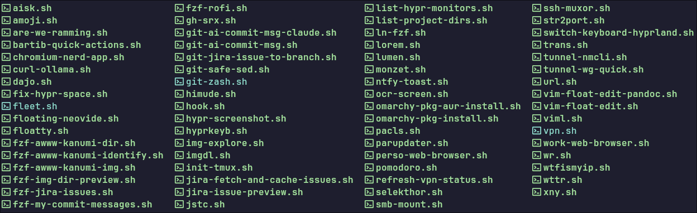

# 🛠️ scripts

Here, I store my personal collection of shell scripts that I rely on everyday.
For Linux automation, Hyprland WM, git workflows, fzf/rofi launchers, Jira integration, AI tooling and more...

In most of the scripts, I tend to use the following CLI tools:

- fzf: <https://github.com/junegunn/fzf>
- gum: <https://github.com/charmbracelet/gum>
- jq: <https://github.com/jqlang/jq>
